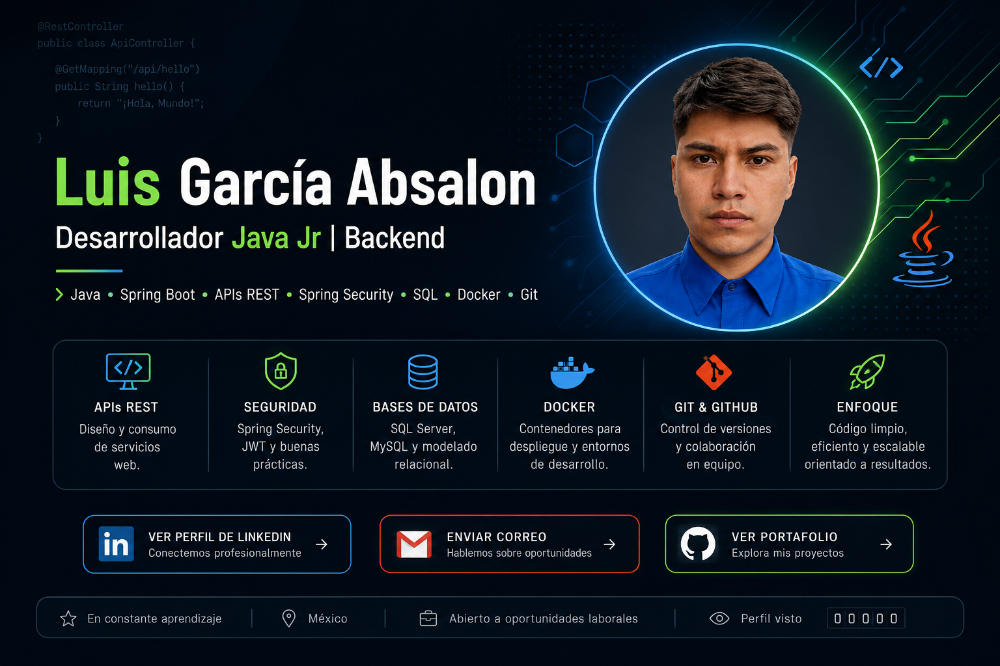

<!-- ===================================================== -->
<!--                 BANNER PRINCIPAL                      -->
<!-- ===================================================== -->

  

 

<!-- ===================================================== -->
<!--                  PRESENTACIÓN                         -->
<!-- ===================================================== -->

<h1 align="center">Hola 👋, soy Luis García</h1>

<h3 align="center">
  Desarrollador Java Jr | Backend
</h3>

  

  Egresado de <b>Ingeniería en Sistemas Computacionales</b>,
  enfocado en desarrollo Backend con <b>Java y Spring Boot</b>.

  Construyendo APIs REST, trabajando con seguridad, bases de datos
  y buenas prácticas de desarrollo Backend.

 

  

  

  

 

---

<!-- ===================================================== -->
<!--                     SOBRE MÍ                          -->
<!-- ===================================================== -->

<h2 align="center">👨‍💻 Sobre mí</h2>

  Soy egresado de <b>Ingeniería en Sistemas Computacionales</b> con interés profesional
  en el desarrollo <b>Backend con Java</b>.

  Actualmente continúo fortaleciendo mis conocimientos en
  <b>Java, Spring Boot, APIs REST, Spring Security, JWT, bases de datos,
  Docker y arquitectura Backend.</b>

  🎯 Mi objetivo es desarrollarme profesionalmente como
  <b>Desarrollador Java Jr / Backend Jr</b> y participar en proyectos
  empresariales donde pueda seguir aprendiendo y aportando soluciones.

 
---

<h2 align="center">🎓 Formación académica</h2>

  <b>Ingeniería en Sistemas Computacionales</b> 
  Tecnológico de Estudios Superiores de Coacalco 
  2021 – 2026

  Egresado | Título en proceso

---

<!-- ===================================================== -->
<!--                   TECNOLOGÍAS                         -->
<!-- ===================================================== -->

<h2 align="center">⚙️ Stack Tecnológico</h2>

<h3 align="center">Backend</h3>

  

  
  
  
  
  
  

 

<h3 align="center">Bases de datos</h3>

  

  
  
  
  

 

<h3 align="center">Herramientas</h3>

  

  
  
  
  
  
  

 

---

<!-- ===================================================== -->
<!--                 PROYECTOS DESTACADOS                  -->
<!-- ===================================================== -->

<h2 align="center">🚀 Proyectos destacados</h2>

  Proyectos donde he aplicado conocimientos de desarrollo Backend,
  APIs REST, seguridad, bases de datos y desarrollo web.

 

<!-- ================= PROYECTO 1 ================= -->

<h3>🔐 API REST Segura | Java & Spring Boot</h3>

> Backend desarrollado con Java 17 y Spring Boot aplicando arquitectura por capas, seguridad con JWT, persistencia de datos e integración con servicios externos.

  
  
  
  
  
  

### ✨ Características

- Arquitectura **Controller → Service → Repository**
- Desarrollo de endpoints REST
- Persistencia mediante **Spring Data JPA**
- Base de datos H2
- Seguridad mediante **Spring Security**
- Autenticación utilizando **JWT**
- OAuth2 Resource Server
- Integración con API externa **PokeAPI**
- Cifrado mediante **AES/CBC**
- Bitácora automática utilizando **AOP**
- Documentación con **Swagger / OpenAPI**
- Pruebas de endpoints mediante **Postman**
- Configuración para ejecución con **Docker**

  

 

---

<!-- ================= PROYECTO 2 ================= -->

<h3>🌐 DESSVI | Sitio Web Corporativo</h3>

> Sitio web desarrollado durante mis residencias profesionales para presentar información institucional, servicios, clientes y medios de contacto de una empresa.

  
  
  
  
  

### ✨ Características

- Diseño responsivo
- Información institucional
- Presentación de servicios
- Sección de clientes
- Acreditaciones
- Formulario de contacto
- Validación de información
- Integración con PHP
- Adaptación del proyecto para portafolio público

  

  

 

---

<!-- ================= PROYECTO 3 ================= -->

<h3>🍣 Sistema de Gestión para Restaurante</h3>

> Aplicación Backend orientada a digitalizar procesos operativos de un restaurante que actualmente se realizan de forma manual.

  
  
  
  
  

### 🎯 Funcionalidades planeadas

- Gestión de clientes
- Gestión de productos
- Registro de pedidos
- Control de ventas
- Persistencia de información
- Envío de comandas
- Control de cuenta
- Arquitectura por capas

  

 

